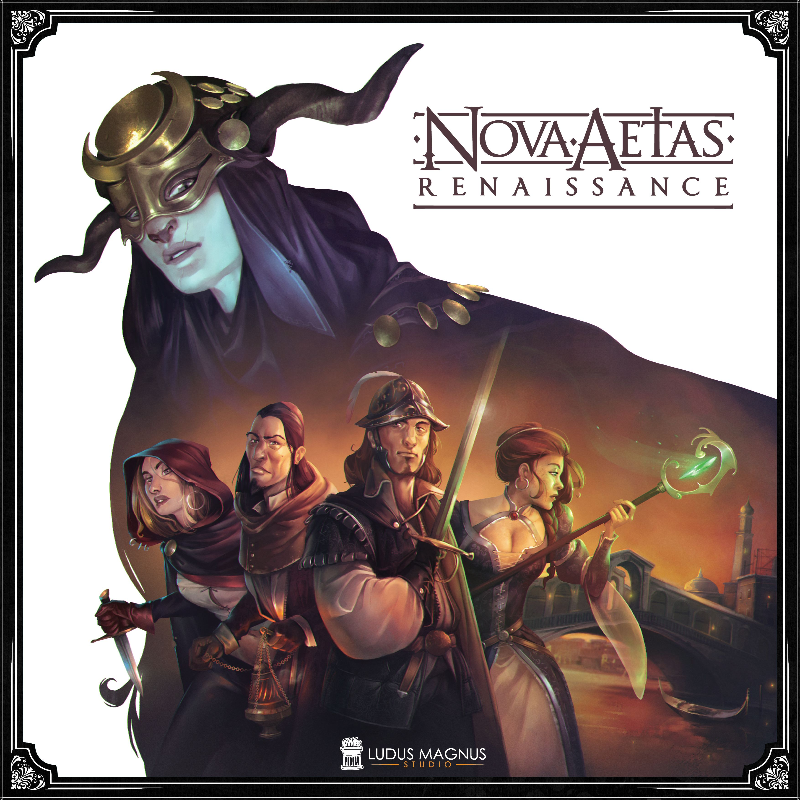

In nicht einmal drei Wochen ist es soweit bis wir uns wie jedes Jahr zum Großen TST in Lütjensee treffen. Zeit also, mal [einen Blick darauf zu werfen](https://boardgamegeek.com/geeklist/340544/grosser-tst-2024), was die Teilnehmer bisher so alles an Spielen bei uns angemeldet haben!

<!--more-->

Falls ihr weitere Spiele anmelden möchtet, meldet euch gerne in unserem Discord und/oder direkt bei Burkhard.

# Brettspiele

## Diplomacy

[BoardGameGeek](https://boardgamegeek.com/boardgame/483/diplomacy) | [Offizielle Website](https://www.avalonhill.com/de-de)

Diplomacy gehört zu den ältesten, modernen Brettspielen und es tut genau das, was der Name verspricht:

_"Eine schöne Lübecker Bucht haben sie da. Wäre doch schade, wenn meine Kanonenboote die blockieren müssten. Wir erwarten ihre erste Marzipanlieferung Montag nach dem Großen TST!"_

## Eclipse - New Dawn for the Galaxy

[BoardGameGeek](https://boardgamegeek.com/image/5235277/eclipse-second-dawn-for-the-galaxy) | [Offizielle Website](https://en.lautapelit.fi/product/24681/eclipse---2nd-dawn-for-the-galaxy)

Eclipse gibt euch Kontrolle über eine ausserirdische Zivilisation, die zum intergalaktischen Ruhm geführt werden will. Ein klassisches 4X (Explore, Expand, Exploit, Exterminate) Brettspiel mit einer Prise Euro game Flair.

## The Edge: Dawnfall

[BoardGameGeek](https://boardgamegeek.com/boardgame/207729/the-edge-dawnfall) | [Offizielle Website](https://awakenrealms.com/games/awaken-realms/the-edge-dawnfall)

The Edge: Dawnfall ist (laut Website) ein dynamisches Miniatur- und Kartenspiel mit Territorialkontrollelementen sowie einem Kampagnenmodul. Wenn das Spiel so komplex ist wie die deutsche Sprache dann erwartet uns da sicherlich eine Spieleperle!

## Mansions of Madness - Second Edition

[BoardGameGeek](https://boardgamegeek.com/boardgame/205059/mansions-of-madness-second-edition) | [Offizielle Website](https://www.fantasyflightgames.com/en/mansions-of-madness-second-edition/products/mansions-madness-second-edition/)

Mansions of Madness ist ein Klassiker angesiedelt in H.P. Lovecraft's Cthulhu Universum. Übernehmt einen Ermittler und kommt dem Mythos auf die Spur -- oder werdet zum Kultisten und spielt fortan für das Spiel und gegen die Gruppe.

## Nemesis

[BoardGameGeek](https://boardgamegeek.com/boardgame/167355/nemesis) | [Offizielle Website](https://awakenrealms.com/games/awaken-realms/nemesis)

In Nemesis erwacht ihr an Bord eines führerlosen Raumschiffes in der Kyrostasekammer neben euren vermeintlich freundlich gesinnten Crew-Mitgliedern und kümmert euch fortan um euer Überleben -- oder auch nicht. Aliens, das Brettspiel.

## Nova Aetas Renaissance

[BoardGameGeek](https://boardgamegeek.com/boardgame/311823/nova-aetas-renaissance) | [Offizielle Website](https://ludusmagnusstudio.com/nova-aetas-renaissance-page/)

Auch hier habe ich wieder keine Ahnung was uns erwartet. Der Name ist schön, BGG beschreibt Nova Aetas Rennaisance als taktisches Brettspiel in einem fantastischen Italien zur Zeit der Renaissance und bewertet ist das Ganze mit einer stolzen 8.5! Ich glaube, an den Tisch werde ich mich mal setzen...

## Scarface 1920

[BoardGameGeek](https://boardgamegeek.com/image/5926553/scarface-1920) | [Offizielle Website](https://redzengames.com/game/scarface-1920/)

Es sind die 1920er Jahre, ihr seid in Chicago und eure Gang versucht verzweifelt die Arbeiterklasse mit Alkohol zu versorgen ohne von der Polizei erwischt zu werden. Ein Spiel so gut wie ein Film von Martin Scorsese und ein Pflichttitel für Burkhard!

## Too Many Bones

[BoardGameGeek](https://boardgamegeek.com/boardgame/192135/too-many-bones) | [Offizielle Website](https://chiptheorygames.com/games/too-many-bones/)

Ein weiteres Spiel aus der Reihe "Noch nie gehört, aber der Name ist schön und die Bewertungen bei BGG auch!" Wir sind gespannt.

## Trudvang Legends

[BoardGameGeek](https://boardgamegeek.com/boardgame/266064/trudvang-legends) | [Offizielle Website](https://www.cmon.com/products/trudvang-legends/)

In Trudvang Legends trifft schwedische Folklore auf eure Heldengruppe oder umgekehrt. Wie's sich genau spielt, lernen wir dann am Tisch!

## Unfathomable / Abgrundtief

[BoardGameGeek](https://boardgamegeek.com/boardgame/340466/unfathomable) | [Offizielle Website](https://www.fantasyflightgames.com/en/unfathomable/)

Seid ihr ein Mensch oder ein Hybrid? Spielt ihr für oder gegen die Gruppe? Das Einzige, was gesetzt ist, ist, dass ihr an Bord eines Ozeandampfers auf dem Weg nach New York City seid und es mit jedem Zug unwahrscheinlicher wird, dass das Schiff auch tatsächlich ankommt...

## Zombicide - Undead or Alive

[BoardGameGeek](https://boardgamegeek.com/boardgame/331224/zombicide-undead-or-alive) | [Offizielle Website](https://www.cmon.com/products/zombicide-undead-or-alive/)

Nach Zombicide in der Moderne, Zombicide im Mittelalter und Zombicide im Weltraum kommt nun Zombicide im Wilden Westen. Eine grandiose Spielereihe, die neben dem tollen Spielprinzip auch immer wieder überrascht auf welche Weise man Zombies noch melken kann!

# Tabletop

## Age of Sigmar - Spearhead

[Warhammer Community](https://www.warhammer-community.com/2024/05/01/introducing-spearhead-a-fast-and-furious-new-mode-for-newaos/)

Spearhead ist das neue, schnellere Spielformat für Warhammer - Age of Sigmar. Kleinere Armeen treten gegeneinander auf einem Viertel der Spielfläche der großen Schwester an.

## Fallout - Wasteland Warfare

[BoardGameGeek](https://boardgamegeek.com/boardgame/226176/fallout-wasteland-warfare) | [Offizielle Website](https://modiphius.us/products/fallout-wasteland-warfare-two-player-starter-set)

_"Krieg. Krieg bleibt immer gleich. 2077 war der Schrecken des Weltkriegs zurückgekehrt. In nur zwei Stunden wurde fast der gesamte Planet in Schutt und Asche gelegt und aus der Asche der nuklearen Zerstörung kämpfte eine neue Zivilisation um Überleben."_

## Warhammer - The Old World | Oldhammer

[Offizielle Website](https://theoldworld.com/) | [Oldhammer Forum](https://forum.oldhammer.org/)

Das einzig wahre Warhammer.

# Rollenspiel

Ausser einem ominös, mysteriösen _"D&D Abenteuer in 3D"_ ist bislang noch nichts angemeldet worden. Man darf also gespannt sein! Wie gewohnt finden sich aber mit Sicherheit wieder spontane Runden für Fiasko oder vergleichbare One-shot Abenteuer zusammen.